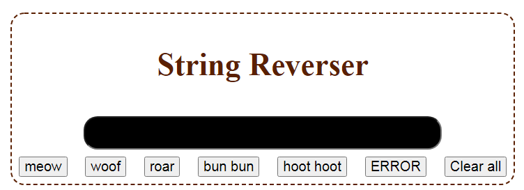
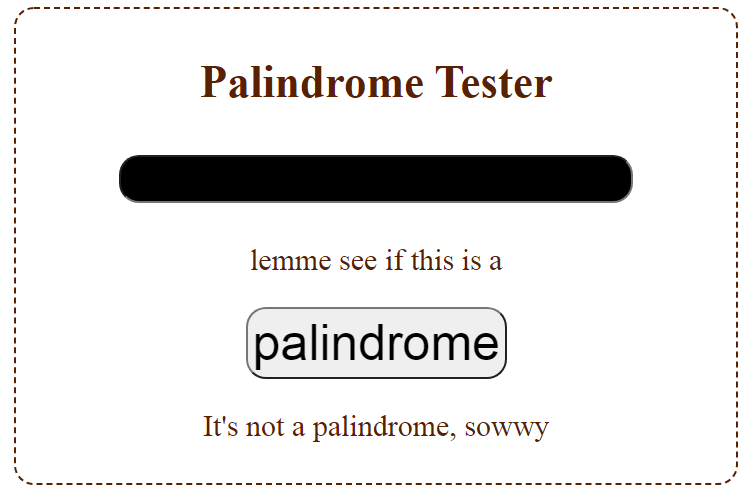
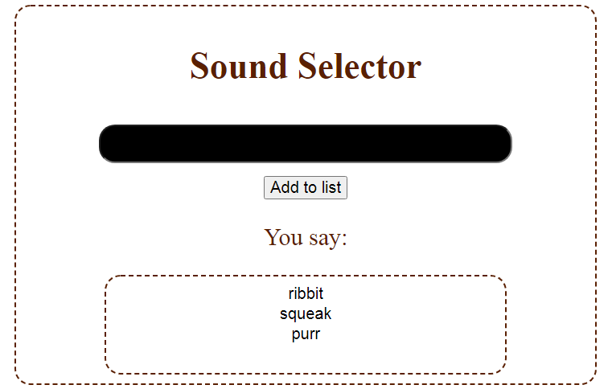
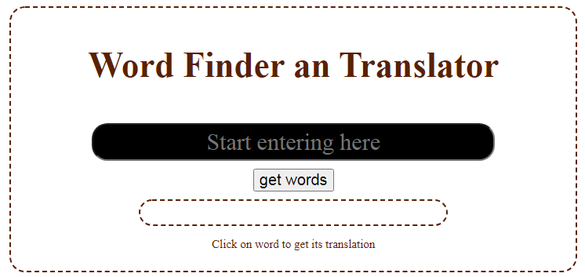
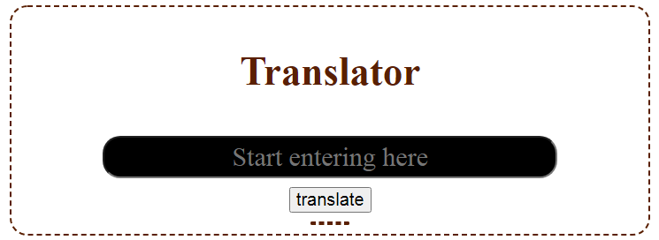

Для работы необходимо запустить сервер с репозитория - https://github.com/Annora-Charming/words.git

Технологии использованные в проекте

*Vue (1)
*Тесты (3) (не всё покрыто)
*Линтер (3)
*Обращение в сеть (3)

Итого - 10/16
(https://github.com/dmitryweiner/lectures/blob/main/907%D1%81%D0%B2.md)

## Project setup
```
npm install
```

### Compiles and hot-reloads for development
```
npm run serve
```

### Lints and fixes files
```
npm run lint
```
Компонент Reverser
Введенная в поле строка будет выведена в обратном порядке. Нажатие на кнопки добавляет определнную последовательность символов к введенной строке, кнопка "ERROR" перезаписывает строку полностью, а кнопка "" - очищает поле ввода






Что еще можно сделать:
